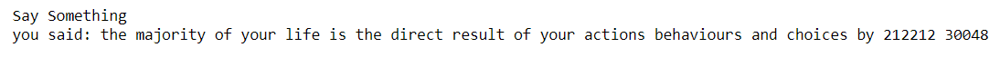

<H3>Name : Kaushika A</H3>
<H3>Reg no: 212221230048</H3>
<H3>EX. NO: 8</H3>
<H3>DATE: 27-04-2024</H3>
<H1 ALIGN =CENTER>Implementation of Speech Recognition</H1>
<H3>Aim:</H3> 
 To implement the conversion of live speech to text.<BR>
<h3>Algorithm:</h3>

**`Step 1:`** Import the `speech_recognition` library<Br>
**`Step 2:`** Initialize the Recognizer<Br>
**`Step 3:`** Create an instance of the Recognizer class, which will be used for recognizing speech.<Br>
**`Step 4:`** Set the duration for audio capture<Br>
**`Step 5:`** Define a variable to specify the duration (in seconds) for which the program will capture <Br>
&nbsp;&nbsp;&nbsp;&nbsp;&nbsp;&nbsp;&nbsp;&nbsp;&nbsp;&nbsp;&nbsp;&nbsp;&nbsp;&nbsp;&nbsp;&nbsp;audio from the microphone.<Br>
**`Step 6:`** Display a message in the console to prompt the user to speak.<Br>
**`Step 7:`** Capture audio from the default microphone<Br>
**`Step 9:`** Use the default microphone as the audio source.<Br>
**`Step 10:`** Record audio for the specified duration using the Recognizer instance.<Br>
**`Step 11:`** Perform speech recognition with exceptional handling:<Br>
&nbsp;&nbsp;&nbsp;&nbsp;&nbsp;&nbsp;&nbsp;&nbsp;&nbsp;&nbsp;&nbsp;&nbsp;&nbsp;&nbsp;&nbsp;&nbsp;&nbsp;&nbsp;•	Attempt to recognize speech from the captured audio using the Google Speech <Br>
&nbsp;&nbsp;&nbsp;&nbsp;&nbsp;&nbsp;&nbsp;&nbsp;&nbsp;&nbsp;&nbsp;&nbsp;&nbsp;&nbsp;&nbsp;&nbsp;&nbsp;&nbsp;&nbsp;&nbsp;&nbsp;Recognition service.<Br>
&nbsp;&nbsp;&nbsp;&nbsp;&nbsp;&nbsp;&nbsp;&nbsp;&nbsp;&nbsp;&nbsp;&nbsp;&nbsp;&nbsp;&nbsp;&nbsp;&nbsp;&nbsp;•	If successful, print the recognized text.<Br>
&nbsp;&nbsp;&nbsp;&nbsp;&nbsp;&nbsp;&nbsp;&nbsp;&nbsp;&nbsp;&nbsp;&nbsp;&nbsp;&nbsp;&nbsp;&nbsp;&nbsp;&nbsp;•	Handle specific exceptions: If the recognition result is unknown or If there is an <Br>
&nbsp;&nbsp;&nbsp;&nbsp;&nbsp;&nbsp;&nbsp;&nbsp;&nbsp;&nbsp;&nbsp;&nbsp;&nbsp;&nbsp;&nbsp;&nbsp;&nbsp;&nbsp;&nbsp;&nbsp;&nbsp;issue with the request to the Google Speech Recognition service, print <Br>
&nbsp;&nbsp;&nbsp;&nbsp;&nbsp;&nbsp;&nbsp;&nbsp;&nbsp;&nbsp;&nbsp;&nbsp;&nbsp;&nbsp;&nbsp;&nbsp;&nbsp;&nbsp;&nbsp;&nbsp;&nbsp;corresponding error messages.<Br>
&nbsp;&nbsp;&nbsp;&nbsp;&nbsp;&nbsp;&nbsp;&nbsp;&nbsp;&nbsp;&nbsp;&nbsp;&nbsp;&nbsp;&nbsp;&nbsp;&nbsp;&nbsp;•	A generic exception block captures any other unexpected errors.<Br>

<H3>Program:</H3>

```py
import pyaudio
import speech_recognition as sr

# initialize the Recognizer
r = sr.Recognizer()

#Set duration for audio capture
duration = 10

#Record audio
print("Say Something")

# USe the default microphone as the audio source
with sr.Microphone() as source:
    audio_data = r.listen(source, timeout=duration)

try:
    text = r.recognize_google(audio_data)
    print("you said:",text)
except sr.UnknownValueError:
    print("Sorry, could not understand audio")
except sr.RequestError as e:
    print(f'Error with the request to Google Speech Recognition Service: {e}')
except Exception as e:
    print(f'Error: {e}')
```
<H3> Output:</H3>



<H3> Result:</H3>

Thus, we have implemented a program that will transcribe the audio file in the file variable and print the transcribed text on the console, one line at a time.
